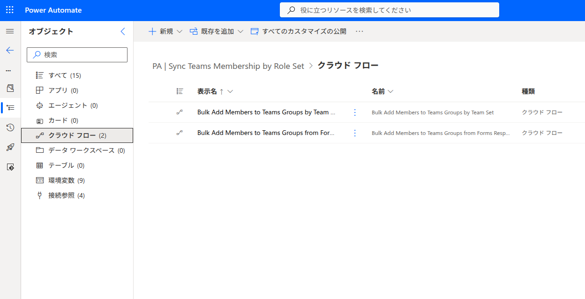
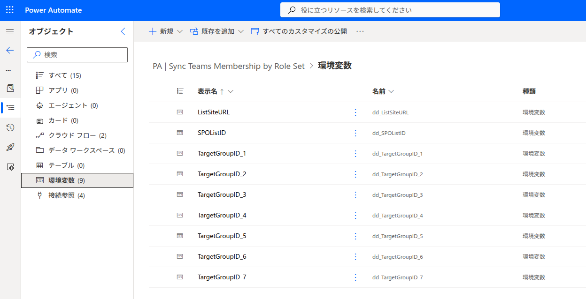
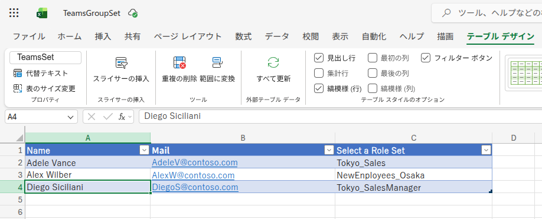
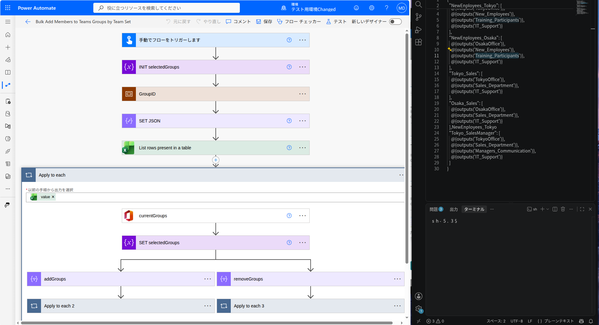

## Setup Guide

This document explains the architecture, design decisions, and configuration of the Teams Membership Management solution.

---

## Purpose

Managing Microsoft Teams memberships manually becomes difficult as organizations grow.

Typical challenges include:

- Users forgetting to join required Teams after a department transfer
- Users remaining in Teams they no longer need access to
- New employees requiring membership in multiple Teams
- Manual membership maintenance by Team owners

To address these issues, this solution introduces the concept of a **Team Set**.

Instead of assigning users directly to individual Teams, users are assigned to a Team Set that represents a business role.

The solution then automatically:

- Adds users to required Teams
- Removes users from unnecessary Teams
- Synchronizes Microsoft 365 Group memberships
- Supports both administrator-driven batch processing and user self-service enrollment

---

## Solution Components

The solution contains two Power Automate flows.



### Bulk Add Members to Teams Groups by Team Set

Batch processing flow.

This flow is intended for administrators who want to process multiple users at once using Excel.

---

### Bulk Add Members to Teams Groups from Forms Responses

Self-service enrollment flow.

This flow is triggered when users submit a role selection form.

---

## Overall Architecture

```text
User
   ↓
Excel / SharePoint Form
   ↓
Power Automate
   ↓
Team Set Definition
   ↓
Microsoft 365 Groups
   ↓
Microsoft Teams
   ↓
Engage / Planner
```

---

## Team Set Concept

A Team Set represents a business role.

Example:

```text
Tokyo_Sales
```

Required memberships:

```text
Tokyo Office
Sales Department
IT Support
```

Rather than assigning users directly to Teams, administrators manage Team Sets.

This simplifies administration and reduces configuration errors.

---

## Environment Variables

Deployment-specific settings are stored in Environment Variables.



Examples:

```text
ListSiteURL
SPOListID

TargetGroupID_1
TargetGroupID_2
TargetGroupID_3
TargetGroupID_4
TargetGroupID_5
...
```

Benefits:

- Easier deployment between environments
- Reduced hardcoding
- Simplified maintenance
- Better ALM support

---

## Excel-Based Processing

### Sample Excel Table

The batch processing version uses Excel as its data source.



Required columns:

```text
Name
Mail
Select a Role Set
```

Example:

```text
Adele Vance
AdeleV@contoso.com
Tokyo_Sales
```

---

### Excel Flow Architecture

The Excel implementation processes all rows found in the table.



Processing sequence:

```text
Manual Trigger
↓
Load Group IDs
↓
Build Team Set Configuration
↓
Read Excel Rows
↓
Retrieve Current Memberships
↓
Determine Required Memberships
↓
Add Missing Groups
↓
Remove Unnecessary Groups
```

---

## Team Set Definition

Team Sets are maintained using JSON.

Example:

```json
{
  "Tokyo_Sales": [
    "TokyoOffice",
    "SalesDepartment",
    "ITSupport"
  ],

  "Tokyo_SalesManager": [
    "TokyoOffice",
    "SalesDepartment",
    "ManagersCommunication",
    "ITSupport"
  ]
}
```

The Team Set selected by the user determines the Microsoft 365 Groups that should contain the user.

Because the synchronization logic is independent of Team Set definitions, administrators can introduce new Team Sets without redesigning the flow.

---

## Membership Synchronization Logic

The synchronization engine compares current memberships with required memberships.

### Current Memberships

```text
Tokyo Office
Development Department
IT Support
```

### Required Memberships

```text
Tokyo Office
Sales Department
IT Support
```

### Synchronization Result

#### Add

```text
Sales Department
```

#### Remove

```text
Development Department
```

### Final Memberships

```text
Tokyo Office
Sales Department
IT Support
```

The user belongs only to the groups defined by the selected Team Set.